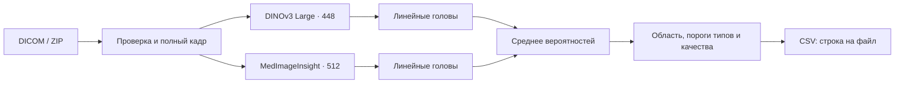

# Radiance · контроль качества DXA

Сайт и автономный сервис проверки денситометрии: DICOM → анатомическая область,
качество, типы нарушения → CSV. Модель команды **Radiance**: DINOv3 Large + MedImageInsight.
Инференс работает без сети, обучения и обращения к облачным моделям.

> **Для запуска модели нужны веса из [GitHub Release v1.0.0](https://github.com/sefixnep/LCT26/releases/tag/v1.0.0).**
> Клонирование репозитория или скачивание **Source code (zip)** не включает два файла энкодеров.
> Скачайте их из раздела **Assets** и разместите по [инструкции](docs/DEPLOYMENT.md#веса)
> **до сборки Docker**. Головы и конфигурации модели уже находятся в репозитории.

| Вход | Выход |
|---|---|
| Однокадровые монохромные DICOM поясничного отдела и проксимального отдела бедра | Одна строка CSV на каждый файл, включая ошибки и дубли |
| Папка, отдельный файл или ZIP | Область, класс качества, оценка нарушения, типы, UID, статус и время |

## Финальная поставка

| Часть | Точка входа |
|---|---|
| Решение и состав поставки | [Схема решения](docs/SOLUTION.md) |
| Сайт + модель на одном сервере | `docker/compose.yaml`, CUDA — `docker/compose.cuda.yaml` |
| VDS + отдельный GPU-сервер | [Подключение сайта](docs/WEBSITE.md) |
| Модель Radiance 1.0 | [Карточка модели](models/radiance/README.md) |
| Обязательные веса и дополнительные файлы поставки | [GitHub Release v1.0.0 → Assets](https://github.com/sefixnep/LCT26/releases/tag/v1.0.0) |
| Установка и эксплуатация | [Развёртывание](docs/DEPLOYMENT.md) |
| Исследования и воспроизведение | [research/](research/README.md) |

## Сайт

Рабочее место с загрузкой DICOM/ZIP, результатами по снимкам, фильтрами,
разбором критериев и скачиванием CSV. Отдельная страница объясняет модель и
границы оценки. Учебный пример явно помечен и доступен без GPU.

```bash
python3.12 -m venv web/.venv
web/.venv/bin/pip install -r web/requirements.txt
DXA_UPSTREAM_URL=http://127.0.0.1:8080 web/.venv/bin/uvicorn web.app:app \
  --host 127.0.0.1 --port 8000 --no-access-log
```

Открыть [localhost:8000](http://127.0.0.1:8000). Для настоящей проверки нужен Radiance API,
запущенный ниже или подключённый через SSH-туннель. [Сайт, Docker и схема VDS → vast.ai](docs/WEBSITE.md).
Развёртывание на VDS выполняется отдельно с владельцем.

## Быстрый запуск

Требования: Linux x86_64, Docker с Compose ≥2.30, Python ≥3.11 для подготовки весов, 8 ГБ RAM
как исходный ориентир; для сборки оставьте 20 ГБ диска (CUDA — 30 ГБ).
Для GPU нужен NVIDIA Container Toolkit и видеокарта с поддержкой CUDA 12.6;
проверенная GPU-среда — RTX 3080 20 ГБ. Подробнее — [развёртывание](docs/DEPLOYMENT.md).

```bash
# Скачать два encoder.pt из GitHub Release в каталоги models/radiance/member_0 и member_1.
# Пошаговые команды для приватного репозитория: docs/DEPLOYMENT.md.
python3 -m src.utils.prepare_model --verify-only

# Собрать и запустить сайт на localhost:8000 и API на localhost:8080.
docker compose -f docker/compose.yaml up -d --build --wait --wait-timeout 300
# На Linux с NVIDIA GPU:
# docker compose -f docker/compose.yaml -f docker/compose.cuda.yaml up -d --build --wait --wait-timeout 300
```

Веса прикреплены к [GitHub Release v1.0.0](https://github.com/sefixnep/LCT26/releases/tag/v1.0.0),
контрольные суммы — в `models/radiance/weights.json`. Репозиторий приватный: для скачивания
нужен доступ к GitHub, **HF-токен не требуется**. При открытом доступе к assets
`python3 -m src.utils.prepare_model` скачивает и проверяет их автоматически.
Локальный исследовательский комплект восстанавливается через
`--from-directory artifacts/ml-final`.

В другом терминале:

```bash
curl --fail http://127.0.0.1:8080/health
curl --fail -X POST http://127.0.0.1:8080/batch \
  -H 'Content-Type: application/zip' --data-binary @studies.zip -o results.csv
```

Swagger: [localhost:8080/docs](http://127.0.0.1:8080/docs).
Остановка: `docker compose -f docker/compose.yaml down`. Оба сервиса доступны
только на локальном интерфейсе хоста. Отдельный API: `./docker/run.sh cpu`
или `./docker/run.sh cuda`.

## Пакетная обработка без HTTP

В уже собранном образе, без сети и без подключения репозитория:

```bash
docker run --rm --platform linux/amd64 --network none --read-only \
  --tmpfs /tmp:rw,nosuid,size=1g \
  --mount type=bind,src="$(pwd)/input",dst=/input,readonly \
  --mount type=bind,src="$(pwd)/output",dst=/output \
  radiance:cpu python -m src.solution.batch /input --output /output/results.csv
```

Создайте `input/` и `output/` заранее; каталог вывода должен быть доступен UID 10001
на запись. Для CUDA-образа добавьте `--gpus all`, тег `cuda` и `--device cuda`.
Локальный запуск Python и команды проверки — в [руководстве по развёртыванию](docs/DEPLOYMENT.md).

## Как устроен пайплайн



Оба энкодера заморожены. Изображение сохраняет полный кадр и исходные пропорции,
дополняется полями; обрезка и геометрические преобразования не применяются.
Для каждой модели обучены голова области, пять голов нарушений и две головы качества.
Их вероятности усредняются с весами 0,5/0,5. Пороги получены только на внутренних
групповых прогнозах. Никакие параметры не подстраиваются под входящий пакет.

## Качество и ограничения

249 размеченных изображений, 100 исследований, три внешних групповых фолда.
Внутри каждого обучающего фолда выбирались регуляризация, балансировка и пороги.

| Метрика | Основное разбиение | 95% ДИ | Второе разбиение |
|---|---:|---:|---:|
| F1 качества | **0,613** | 0,516–0,703 | 0,577 |
| ROC-AUC качества | **0,805** | 0,740–0,865 | 0,754 |
| Macro-F1 пяти нарушений | 0,460 | 0,319–0,548 | 0,421 |

Это разработческие OOF после выбора рецепта, **не независимый тест**.
ДИ по исследованиям не учитывают поиск моделей. Из-за анонимизации нельзя
подтвердить независимость пациентов; соответствие сторон бедра меткам требует
экспертной проверки. Редкие цели нестабильны: ROI — 7 положительных снимков,
наклон оси — 10. Перенос на другие аппараты и клиническое применение не проверены.

Повторный [аудит](research/AUDIT.md) воспроизвёл головы, пороги, OOF и все метрики.
Обнаруженных нарушений группового протокола нет; ограничения независимости выше сохраняются.
Технически итоговая поставка обработала **502/502 DICOM за 82,35 с на RTX 3080**;
максимум 4,75 с на исследование, холодная загрузка 24,69 с отдельно.
Проверки контейнеров и сайта — [отчёт поставки](docs/DELIVERY.md).

## Контракт результата

`quality_class`: 0 — нарушение не обнаружено, 1 — обнаружено.
`quality_prob`: непрерывная оценка нарушения в [0;1], не калиброванный клинический риск.
`violation_type`: применимые типы через `; `; класс равен наличию хотя бы одного типа.
При `Failure` неизвестные поля пустые, остальные файлы продолжают обрабатываться.
UID сохраняются из DICOM. Проекции и локализации отдельными полями не выдаются.

[Все колонки, типы нарушений, ограничения ZIP и ошибки API →](docs/USER_GUIDE.md)

## Состав репозитория

| Путь | Назначение |
|---|---|
| `src/solution/` | DICOM, модель, CLI и API; единственный код инференса |
| `src/utils/` | подготовка данных/весов, обучение, оценка и проверки |
| `src/config.py` | пути и точные строки выходного контракта |
| `models/radiance/` | финальные головы, конфигурации, хеши, метрики и лицензии |
| `docker/` | закреплённые зависимости, Dockerfile, запуск CPU/CUDA |
| `web/` | интерфейс, Python-шлюз и отдельный лёгкий контейнер |
| `docs/` | схема решения, руководства пользователя, развёртывание и проверка поставки |
| `research/` | обучение, исследования, отрицательные результаты, происхождение модели и аудит метрик |
| `context/` | требования, решения и исходные документы конкурса в `organizers/` |
| `PRODUCT.md`, `DESIGN.md` | назначение сайта и правила интерфейса |
| `data/`, `artifacts/` | локальные данные и исследовательские артефакты, вне git и образа |

## Документация

- [Сайт и подключение к GPU](docs/WEBSITE.md)
- [Финальный аудит метрик и утечек](research/AUDIT.md)
- [Руководство пользователя и API](docs/USER_GUIDE.md)
- [Развёртывание и автономный запуск](docs/DEPLOYMENT.md)
- [Обучение и воспроизведение Radiance](research/TRAINING.md)
- [Карточка модели и происхождение весов](models/radiance/README.md)
- [Проверки поставки и демо-сценарий](docs/DELIVERY.md)
- [Полный журнал экспериментов](research/EXPERIMENTS.md) и [завершающий ML-цикл](research/ML_CYCLE3.md)

## Лицензии

DINOv3 распространяется на условиях [DINOv3 License](models/radiance/licenses/DINOv3.md),
MedImageInsight — [MIT](models/radiance/licenses/MedImageInsight.txt).
Условия компонентов не заменяются общей лицензией репозитория.
Снимки, разметка и секреты не включаются в контейнер или комплект модели.
Собственный код — [MIT](LICENSE). Шрифт Golos Text — [SIL OFL](web/static/fonts/OFL.txt).
Исходные документы организаторов в `context/organizers/` сохраняют права авторов;
MIT проекта к ним не применяется. История и материалы ведутся в этой же ветке `main`.
